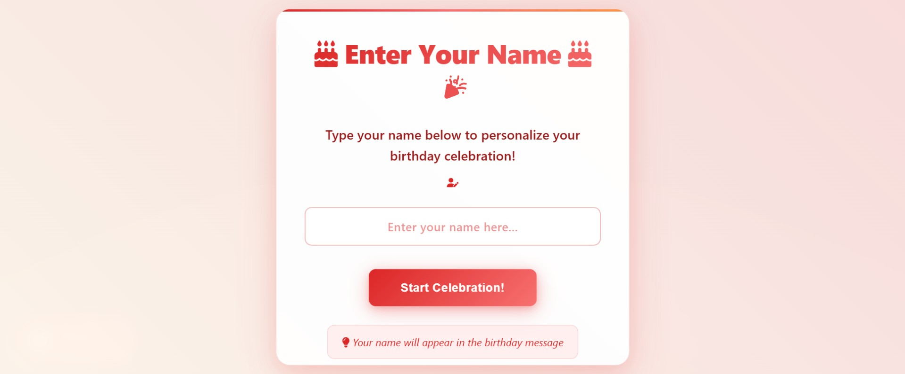
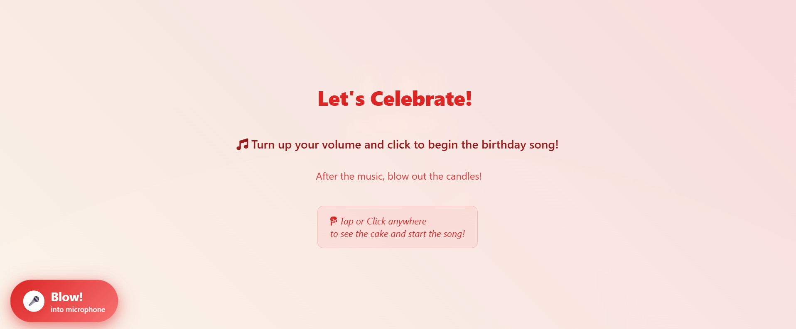
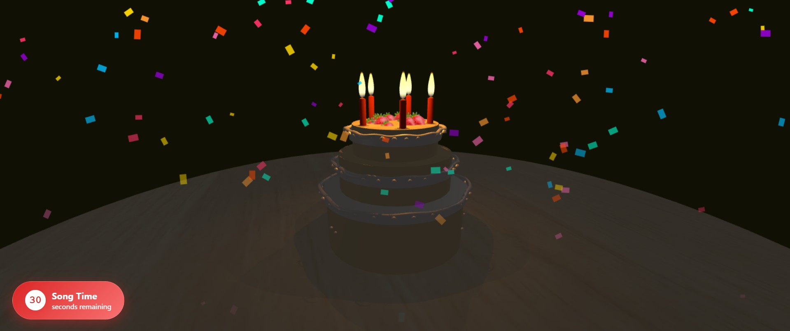
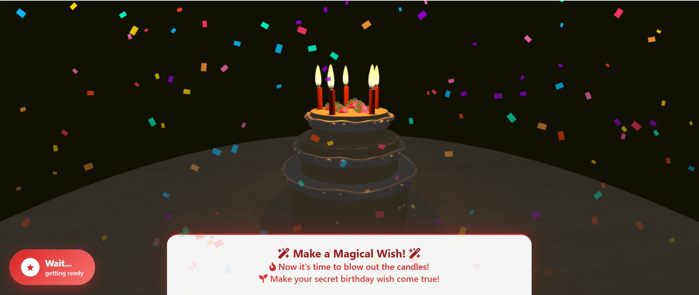
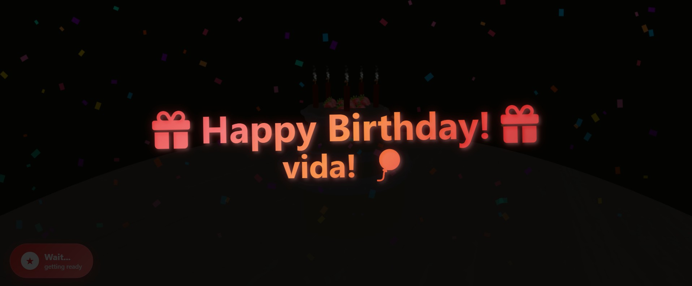

# 🎂 3D Birthday Cake Experience
Create a magical birthday moment with an interactive 3D cake that responds to your touch—or your breath! Perfect for birthdays, virtual parties, or just a cheerful surprise.

---

## ✨ What Makes This Special

- **🍰 Personalized 3D Cake**  
  A beautifully animated cake featuring your name in festive decorations

- **🕯️ Interactive Candles**  
  Blow into your microphone to extinguish digital candles (mobile-friendly tap/hug option available!)

- **🎶 Birthday Soundtrack**  
  Classic "Happy Birthday" melody to set the celebratory mood

- **🎉 Visual Festivities**  
  Sparkling effects, confetti showers, and celebratory lighting

- **📱 Universal Access**  
  Enjoy the experience on any device—desktop, tablet, or phone

---

## 🎬 Experience Walkthrough

### **1. Personalize Your Cake**
  
Enter your name (or a friend's!) to customize your celebration

### **2. Start the Celebration**
  
Click to begin—your cake and music will start simultaneously

### **3. Cake Reveal**
  
Watch as your 3D birthday cake appears with accompanying music

### **4. Candle Moment**
  
Get ready to blow out the candles using your microphone

### **5. Final Celebration**
  
Enjoy personalized congratulations with sparkles and confetti

---

## 🚀 Demo

### [🎂 Start Your Birthday Experience Here](https://threed-birthday-cake.onrender.com/)

*No downloads • No registration • Instant celebration*

---

## 🛠️ TECHNICAL STUFF (FOR NERDS WHO LIKE NERDY THINGS)

- **Three.js** = "3D Cake Baker" 🍰
- **Web Audio API** = "Ear Whisperer & Breath Detective" 🎤🕵️
- **JavaScript** = "Party Planner" 📋
- **HTML/CSS** = "Decoration Committee" 🎨
- **Your Breath** = "THE MAIN INGREDIENT!" 💨

---

## 🤓 WANNA HOST YOUR OWN PARTY? HERE'S HOW:

```bash
# 2. Enter the party room!
cd three-js-birthday-cake

# 3. Bring party snacks (dependencies)!
npm install

# 4. Start the music!
npm run dev

# 5. INVITE FRIENDS! (Share the URL)
#    (Friends optional but recommended for maximum fun)
```

## Development

1. Clone the repository
2. Install dependencies with `yarn`
3. Run the project with `yarn dev`

---

## Credits

- [The Lonely Candle Codepen](https://codepen.io/prisoner849/pen/XPVGLp)
- [Happy Birthday song (YouTube)](https://www.youtube.com/watch?v=aF8voKa_3Us)
---

## 📱📝 Tips for the Best Experience

- **Turn up your volume** to fully enjoy the song and sound effects.
- To **blow out the candles**:
  - On desktop: Blow strongly and briefly near your microphone (like real candles!)
  - On mobile: Long-press (hold) anywhere on the screen
- Use modern browsers: Chrome, Edge, or Firefox recommended.

## 🛠️ Technologies Used

- **Three.js** – 3D rendering of the cake and candles
- **Web Audio API** – Real-time blow detection via microphone
- **HTML5 Audio** – Playing the birthday song
- **Vanilla JavaScript** – No frameworks
- **Modern CSS** – Animations and responsive layout

## 👤 Personalization

The entered name is displayed in the final message:  
**"Happy Birthday, [Your Name]!"**

## 📂 Project Structure

``` text
-a----        12/24/2025  10:42 PM         922221 happy-birthday.mp3
-a----        12/26/2025  11:09 PM          13165 index.html
-a----        12/26/2025  10:00 PM           1093 LICENSE
-a----        12/22/2025   4:56 PM          27184 package-lock.json
-a----        12/21/2025   3:55 PM            437 package.json
-a----        12/26/2025  10:00 PM           3273 README.md
-a----        12/26/2025  11:55 PM          34310 script.js
-a----        12/26/2025  11:16 PM          12032 style.css
-a----        12/21/2025   3:55 PM         198400 table.png
-a----        12/21/2025   3:55 PM            397 vite.config.js
-a----        12/22/2025   4:56 PM           4425 yarn.lock

```
---

## 📄 License

This project is licensed under the **MIT License** – see the [LICENSE](LICENSE) file for details.
